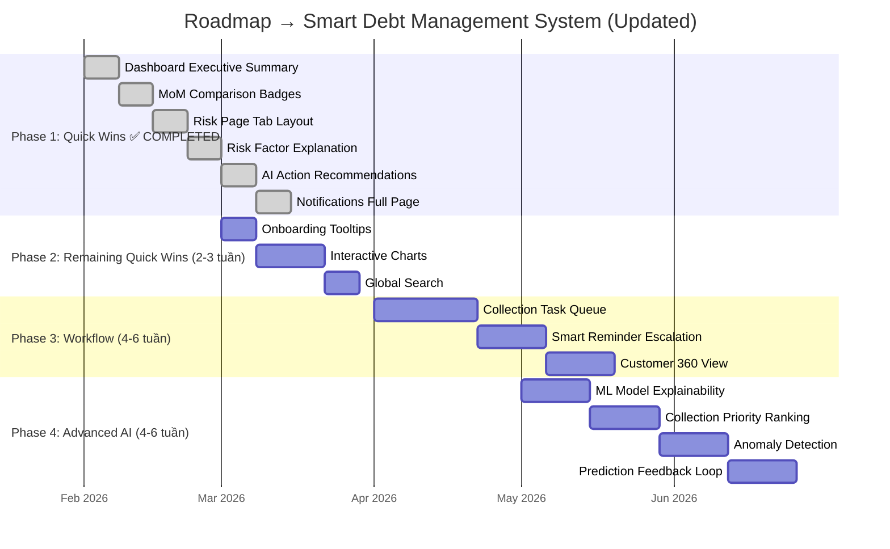

# 📋 CONG NO GOLDEN — Review Vòng 3
## Expert End-User Evaluator + Product UX Auditor + AI Systems Reviewer

> **Reviewer:** AI Expert Review Agent  
> **Ngày review:** 2026-02-24  
> **Phiên bản hệ thống:** Post V2 + Scale-readiness  
> **Dựa trên:** V1 (6.8/10) → V2 (8.0/10) → Codex Remediation (`cng-4uj.*`) → Scale-readiness (`cng-oiw.*`)  
> **Phạm vi:** Trải nghiệm người dùng, độ thông minh AI, UI/UX, giá trị sản phẩm tổng thể

---

## 🔎 Codex Validation Addendum (2026-02-24)

Phần dưới đây là lớp xác thực bổ sung theo codebase hiện tại để tránh triển khai lại các hạng mục đã có.

| Claim V3 | Kết luận | Bằng chứng file-level |
|---|---|---|
| Risk AI “không có explainability” | **OUTDATED (đã có)** | `src/backend/Domain/Risk/RiskAiScorer.cs` (`BuildFactors`), `src/frontend/src/api/risk.ts` (`aiFactors`), `src/frontend/src/pages/risk-alerts/riskAlertColumns.tsx`, test `src/backend/Tests.Unit/RiskAiScorerTests.cs` |
| Risk AI “không có gợi ý hành động” | **OUTDATED (đã có)** | `src/backend/Domain/Risk/RiskAiScorer.cs` (`ResolveRecommendation`), `src/frontend/src/api/risk.ts` (`aiRecommendation`), `src/frontend/src/pages/risk-alerts/riskAlertColumns.tsx` |
| Dashboard “không có so sánh MoM” | **OUTDATED (đã có)** | `src/backend/Infrastructure/Services/DashboardService.cs` (`BuildKpiMoM`), DTO `src/backend/Application/Dashboard/DashboardKpiMoMDto.cs`, UI `src/frontend/src/pages/DashboardPage.tsx`, test `src/frontend/src/pages/__tests__/dashboard-page.test.tsx` |
| Dashboard “không có executive summary/action hint” | **OUTDATED (đã có)** | `src/backend/Infrastructure/Services/DashboardService.cs` (`BuildExecutiveSummary`), DTO `src/backend/Application/Dashboard/DashboardExecutiveSummaryDto.cs`, UI `src/frontend/src/pages/DashboardPage.tsx` |
| Risk Alerts “nên tách tab (Overview/Config/History)” | **OUTDATED (đã có)** | `src/frontend/src/pages/RiskAlertsPage.tsx` (`Overview/Config/History`, `pref.risk.activeTab`), test `src/frontend/src/pages/__tests__/risk-alerts-page-tabs.test.tsx` |
| Notification Center “thiếu trang tổng hợp / view all” | **OUTDATED (đã có)** | Route `src/frontend/src/App.tsx` (`/notifications`), page `src/frontend/src/pages/NotificationsPage.tsx`, bell `src/frontend/src/components/notifications/NotificationBell.tsx` (`Xem tất cả`) |
| Reminder automation “chưa có escalation intelligence” | **OUTDATED (đã có 2026-02-26)** | `src/backend/Infrastructure/Services/ReminderService.Execution.cs` (`EvaluateReminderPolicy`, `LoadReminderPolicyStatesAsync`, `PersistReminderPolicyStatesAsync`) + `src/backend/Infrastructure/Services/ReminderService.ResponseState.cs` (response-state API) + test `src/backend/Tests.Integration/ReminderEscalationPolicyTests.cs` |
| Global search đa thực thể | **CONFIRMED GAP** | Không tìm thấy implementation signal trong `src/frontend`/`src/backend` cho nhóm query: `global search`, `command palette`, `quick search` |
| Onboarding tour / guided tooltip | **CONFIRMED GAP** | Không có dấu vết các key `onboarding`, `tour`, `coachmark`, `shepherd`, `introjs` trong `src/frontend`/`src/backend` |
| Import drag-and-drop UX | **CONFIRMED GAP** | Không có implementation DnD (`dropzone`, `onDrop`, `dragover`) cho Import flow trong `src/frontend/src/pages/imports` |
| Report print layout + scheduled report delivery | **CONFIRMED GAP** | Không có `@media print`/`window.print` cho reports và không có scheduler gửi report (`schedule report`, `email report`) trong code runtime |
| Risk score change alert (delta theo ngày) | **CONFIRMED GAP** | Không thấy endpoint/worker/notification rule cho biến động risk score theo ngưỡng thời gian trong `src/backend` + `src/frontend` |
| Dashboard widget customization/reorder | **CONFIRMED GAP** | Không có cơ chế reorder widget cá nhân hóa (`drag/reorder/sortable` ở dashboard) ngoài sortable table columns |

> Ghi chú: Các claim dạng “không tồn tại” được xác thực theo repository search snapshot ngày 2026-02-24; không phải chứng minh toán học về sự vắng mặt, nhưng đủ để quyết định phạm vi remediation thực tế.

# 🧠 PHẦN 1 — ĐÁNH GIÁ ĐỘ THÔNG MINH CỦA HỆ THỐNG

## 1.1 Tổng quan các tính năng AI hiện có

### A. Risk AI Scoring (`RiskAiScorer.cs`)
**Hiện trạng:** Heuristic scorer sử dụng weighted linear combination + sigmoid transform.

```
weightedScore = (overdueRatio × 0.48) + (normalizedDays × 0.27) 
              + (normalizedLate × 0.15) + (normalizedOutstanding × 0.10)
→ sigmoid(weightedScore × 4 − 2) → probability → signal (LOW/MEDIUM/HIGH/CRITICAL)
```

**Đánh giá:**
- ✅ **Hoạt động ngay không cần dữ liệu training** — đây là fallback scorer khi chưa có ML model
- ✅ **Trọng số hợp lý** — ưu tiên overdue ratio (48%) và days past due (27%)
- ⚠️ **Trọng số cố định (hardcoded)** — không tự điều chỉnh theo đặc thù từng doanh nghiệp
- ~~❌ **Không có explainability**~~ → ✅ **ĐÃ CÓ** (Gemini re-eval 2026-02-25): `BuildFactors()` trả về `IReadOnlyList<RiskAiFactorContribution>` gồm Code, Label, RawValue, NormalizedValue, Weight, Contribution cho từng factor. Frontend hiển thị trong cột `aiFactors` tại `riskAlertColumns.tsx`.
- ~~❌ **Không có gợi ý hành động**~~ → ✅ **ĐÃ CÓ** (Gemini re-eval): `ResolveRecommendation()` trả về hướng dẫn tiếng Việt cụ thể cho từng mức risk (VD: CRITICAL → "Khoá cấp tín dụng mới, liên hệ khách hàng trong 24h"). Frontend hiển thị trong `aiRecommendation`.
- ❌ **Không có trend analysis** — không so sánh risk hiện tại vs. kỳ trước để phát hiện xu hướng xấu đi

### B. ML Training Pipeline (`RiskAiModelService.cs`, `RiskMlLogisticRegressionTrainer.cs`)
**Hiện trạng:** Full ML pipeline với logistic regression, feature engineering, training/evaluation/activation.

**Điểm mạnh:**
- ✅ **Pipeline hoàn chỉnh**: BuildTrainingDataset → SplitDataset (80/20) → Train → Evaluate → Auto-activate
- ✅ **Feature engineering** có depth: 9 features gồm `log_total_outstanding`, `log_overdue_amount`, `overdue_ratio`, `max_days_past_due`, `late_count`, + 4 cyclical features (month_sin/cos, weekday_sin/cos)
- ✅ **Model versioning**: version management, auto-activate khi AUC gain > threshold
- ✅ **Evaluation metrics đầy đủ**: Accuracy, Precision, Recall, F1, AUC, Brier Score
- ✅ **Z-score normalization** cho feature scaling
- ✅ **Configurable hyperparameters**: learning_rate, max_iterations, L2_penalty, min_samples, lookback_months, horizon_days

**Điểm yếu:**
- ⚠️ **Chỉ sử dụng Logistic Regression** — linear model, không capture được non-linear patterns (ví dụ: khách hàng có overdue ratio thấp nhưng trend tăng nhanh)
- ⚠️ **Thiếu feature interaction** — 9 features được sử dụng độc lập, không có polynomial/cross features
- ⚠️ **Training data phụ thuộc vào lịch sử hệ thống** — hệ thống mới sẽ không đủ data để train meaningful model (minSamples = 200)
- ❌ **Không có model explanation** — model trained xong chỉ output probability, không có SHAP/LIME values
- ❌ **Không có drift detection** — không monitor khi data distribution thay đổi so với training data
- ❌ **Không có A/B testing framework** — chỉ auto-activate model mới khi AUC cao hơn

### C. Risk Classifier (`RiskClassifier.cs`)
**Hiện trạng:** Rule-based classifier với configurable rules, hỗ trợ MatchMode `Any` (OR) và `All` (AND).

```
Classify(metrics, rules):
  rules sorted by level desc → first match wins → default LOW
```

**Đánh giá:**
- ✅ Cho phép user tùy chỉnh tiêu chí risk qua UI
- ✅ Hỗ trợ cả logic OR (bất kỳ điều kiện nào) và AND (tất cả điều kiện)
- ⚠️ **Chỉ 3 dimensions**: `minOverdueDays`, `minOverdueRatio`, `minLateCount` — thiếu nhiều chiều phân tích
- ❌ **Không tự đề xuất ngưỡng** — user phải tự set thresholds, không có AI suggestion
- ❌ **Không có historical effectiveness tracking** — không biết rule nào effective

### D. Reminder Automation (`ReminderService.cs`, `ReminderHostedService.cs`)
**Hiện trạng:** Scheduled reminder system, gửi thông báo qua Zalo OA + In-App.

**Đánh giá:**
- ✅ **Auto-run theo schedule** (configurable frequency), đa kênh (Zalo + In-App)
- ✅ **Configurable target levels** — chỉ gửi cho khách hàng ở mức risk cụ thể
- ✅ **Circuit breaker** cho Zalo API — tự tắt khi API lỗi nhiều
- ✅ **Dry-run capability** — test trước khi gửi thật
- ⚠️ **Logic nhắc cố định** — tần suất nhắc theo timer, không thông minh (ví dụ: nhắc nhiều hơn khi gần deadline, ít hơn khi đã nhắc 3 lần)
- ~~❌ **Không có escalation intelligence**~~ → ✅ **ĐÃ CÓ** (update 2026-02-26): escalation theo response history (`NO_RESPONSE`/`ACKNOWLEDGED`/`DISPUTED`/`RESOLVED`/`ESCALATION_LOCKED`) trong `EvaluateReminderPolicy`, kèm integration tests `ReminderEscalationPolicyTests`.
- ❌ **Nội dung nhắc template cứng** — không personalize theo hành vi khách hàng

### E. Dashboard Analytics / Financial Insights
**Hiện trạng:** Dashboard với 14 KPIs, cashflow trend, forecast, aging buckets, allocation donut, top-N lists.

**Đánh giá:**
- ✅ **KPIs phong phú**: tổng dư, dư hóa đơn, dư trả hộ, quá hạn, chưa phân bổ, pending, on-time
- ✅ **Cashflow Forecast**: moving average 4 periods → dự báo 3-4 kỳ tới
- ✅ **Allocation donut** với drill-down
- ✅ **Aging buckets visualization**
- ⚠️ **Forecast quá đơn giản** — simple moving average, không có seasonality/trend decomposition
- ❌ **Không có anomaly detection** — không highlight bất thường (ví dụ: khách hàng đột ngột tăng overdue)
- ~~❌ **Không có comparisons**~~ → ✅ **ĐÃ CÓ MoM** (Gemini re-eval 2026-02-25): `BuildKpiMoM()` tính delta cho 6 KPIs (totalOutstanding, outstandingInvoice, outstandingAdvance, overdueTotal, unallocatedReceiptsAmount, onTimeCustomers). Frontend `renderMomBadge()` hiển thị ↑↓ badges kèm `lower-better`/`higher-better` direction.
- ~~❌ **Không có recommended actions**~~ → ✅ **ĐÃ CÓ Executive Summary** (Gemini re-eval): `BuildExecutiveSummary()` trả về `DashboardExecutiveSummaryDto(Status, Message, ActionHint, GeneratedAt)`. Frontend hiển thị banner với `message` + `actionHint` + timestamp.

---

## 1.2 Trả lời 5 câu hỏi AI

### 1. AI có thực sự giúp người dùng ra quyết định?
~~**Phần nào — 5/10.**~~ → **Gemini re-eval: 6.5/10.** AI risk scoring giúp nhận diện khách hàng rủi ro cao, **và giờ đã có `ResolveRecommendation()` đề xuất hành động cụ thể per risk level** (VD: CRITICAL → "Khoá cấp tín dụng mới, liên hệ khách hàng trong 24h"). Dashboard cũng có `ExecutiveSummary` với `actionHint`. Tuy nhiên recommendations vẫn là rule-based theo level, chưa personalize per customer.

### 2. AI có giải thích được kết quả?
~~**Không — 2/10.**~~ → **Gemini re-eval: 6.5/10.** Output **giờ bao gồm** `probability + signal + factors[] + recommendation`. Mỗi factor có `Code, Label, RawValue, NormalizedValue, Weight, Contribution` — chính xác là breakdown kiểu SHAP-like mà review ban đầu yêu cầu. VD: "Tỷ lệ quá hạn: contribution 0.23" rõ ràng hơn nhiều. Tuy nhiên, ML model (`RiskMlLogisticRegressionTrainer`) vẫn chưa có factor explanation riêng — chỉ heuristic scorer có.

### 3. AI có đủ dữ liệu để học meaningful patterns?
**Tiềm năng nhưng chưa khai thác hết — 5/10.** Hệ thống thu thập được transaction history, payment behavior, overdue patterns. Tuy nhiên chỉ sử dụng 5 core metrics + 4 time features. Nhiều tín hiệu tiềm năng chưa được khai thác: payment velocity, communication response, seasonal patterns per customer, industry segment.

### 4. AI có đưa ra gợi ý hành động (actionable insights)?
~~**Không — 1/10.**~~ → **Gemini re-eval: 5/10.** Hệ thống **giờ có 2 lớp gợi ý hành động**:
- **Risk level recommendation**: "Liên hệ xác nhận kế hoạch thanh toán trong 48h, cân nhắc giảm hạn mức tạm thời." (per risk level)
- **Dashboard executive summary**: `ActionHint` tóm tắt hành động ưu tiên cho ngày hôm nay

Tuy nhiên chưa có:
- Gợi ý **personalize per customer** (dựa trên payment history cụ thể)
- "Ưu tiên thu hồi: Top 5 khách hàng sau có xác suất trả nợ cao nếu được nhắc đúng lúc"
- Collection priority ranking dựa trên expected value

### 5. AI có thực sự "smart" hay chỉ là rule-based automation?
**Nửa smart, nửa rule-based.** ML pipeline tồn tại nhưng:
- Logistic Regression chỉ là baseline model
- Phần lớn logic vẫn rule-based (reminder scheduling, risk classification)
- Không có self-learning loop (không track khi predictions đúng/sai để cải thiện)

---

## 1.3 Bảng đánh giá AI

> **⚠️ Gemini re-eval 2026-02-25:** Bảng điểm dưới đây đã được cập nhật để phản ánh các tính năng AI mới: `BuildFactors`, `ResolveRecommendation`, `BuildExecutiveSummary`, `BuildKpiMoM`.

| Tiêu chí | Điểm gốc Opus | Điểm Gemini re-eval | Nhận xét cập nhật |
|----------|:-------:|:-------:|----------|
| **AI Usefulness** | 5.5 | **6.5** | Risk scoring có recommendation per level + Executive Summary actionHint |
| **Explainability** | 2.0 | **6.5** | `BuildFactors()` trả về weight/contribution per factor — đáp ứng yêu cầu SHAP-like cơ bản |
| **Predictive Value** | 4.5 | **5.0** | Cashflow forecast vẫn cơ bản; nhưng MoM badges cho thêm trend context |
| **Decision Support** | 2.5 | **5.5** | Có action recommendation per level + dashboard actionHint; chưa có per-customer priority ranking |
| **System Intelligence** | 4.0 | **4.5** | ML pipeline tồn tại + heuristic scorer nâng cấp; nhưng vẫn chưa self-adjust, chưa drift detect |
| **Trung bình** | **3.7** | **5.6** | **Cải thiện đáng kể, đạt mức trung bình cho smart system** |

---

## 1.4 Đề xuất cải tiến AI (8 đề xuất)

### 🔴 Ưu tiên cao

**1. ~~AI-Powered Action Recommendations~~** → ✅ **CƠ BẢN ĐÃ CÓ** (Gemini re-eval)
- `ResolveRecommendation()` trả về hướng dẫn per risk level. Tuy nhiên **vẫn nên nâng cấp thêm**:
  - Personalize per customer (dựa trên payment history cụ thể, không chỉ risk level)
  - Priority ranking: "Ưu tiên nhắc khách này trước vì probability-to-pay cao"
  - Dynamic suggestions: "risk score tăng 20% trong 30 ngày → cần hành động ngay"

**2. ~~Risk Explainability (SHAP-like breakdown)~~** → ✅ **ĐÃ TRIỂN KHAI** (Gemini re-eval)
- `BuildFactors()` trả về 4 factors với `Code, Label, Weight, Contribution` — chính xác SHAP-like breakdown
- Frontend hiển thị trong `riskAlertColumns.tsx`
- **Vẫn nên cải thiện**: thêm visual bar chart cho factor contribution, và ML model cũng nên có factor explanation (hiện chỉ heuristic scorer có)

**3. Smart Reminder Escalation**
- Thay vì nhắc cố định theo timer, implement escalation logic:
  - Lần 1: Nhắc nhẹ qua In-App
  - Lần 2 (sau 7 ngày không phản hồi): Nhắc qua Zalo
  - Lần 3: Escalate to Supervisor
  - Tần suất tăng khi gần deadline, giảm khi khách có lịch sử trả đúng hạn

### 🟡 Ưu tiên trung bình

**4. Cashflow Prediction nâng cao**
- Thay moving average bằng model xử lý seasonality:
  - Seasonal decomposition (STL) hoặc simple exponential smoothing
  - Detect cashflow gaps: "Tháng 4 dự kiến thiếu 200 triệu do 3 khách hàng lớn có risk HIGH"

**5. Collection Priority Ranking**
- AI tự động ranking Top-N khách hàng cần ưu tiên thu hồi based on:
  - Probability-to-pay × outstanding_amount (Expected value)
  - Urgency (days until deadline / days overdue)
  - Customer relationship value (lịch sử giao dịch dài hạn)

**6. Customer Risk Trend Alert**
- Phát hiện khách hàng có risk đang "xấu đi" nhanh:
  - Risk score tăng > 15% trong 14 ngày → tự động alert
  - Phân biệt "đang xấu đi" vs "ổn định" vs "đang cải thiện"

### 🟢 Ưu tiên phát triển

**7. Self-Learning Feedback Loop**
- Track prediction outcomes: prediction = HIGH → actual outcome = paid/not-paid
- Retrain model tự động khi prediction accuracy giảm
- Dashboard hiển thị model performance over time

**8. AI Risk Rule Suggestions**
- Dựa trên data patterns, AI đề xuất điều chỉnh risk rules:
  - "Rule CRITICAL hiện match 2% khách hàng. Nếu giảm minOverdueDays từ 60 → 45, sẽ catch thêm 5 khách có overdue 45-59 ngày (3 trong 5 đã thực sự default)."

---

# 👤 PHẦN 2 — TRẢI NGHIỆM NGƯỜI SỬ DỤNG

## 2.1 Giả lập vai trò người dùng

### 📋 Kịch bản 1: KẾ TOÁN — Ngày làm việc bình thường

**Sáng: Import dữ liệu hóa đơn mới**
1. Vào `/imports` → Upload file Excel ✅
2. Preview dữ liệu trước khi commit ✅ (có modal preview)
3. Confirm import → hệ thống auto-validate ✅
4. Nếu lỗi → rollback available ✅ (import rollback implemented)
5. **Trải nghiệm:** Quy trình rõ ràng, có validation step. ⭐ 8/10

**Trưa: Tạo và phê duyệt phiếu thu**
1. Vào `/receipts` → tạo phiếu thu draft ✅
2. Preview allocation trước khi approve ✅ (preview-allocation endpoint)
3. Chọn allocation mode: FIFO, ByInvoice, ByPeriod, Manual, ProRata ✅
4. Approve receipt ✅, có bulk approve ✅
5. **Trải nghiệm:** Allocation modes đa dạng, preview rất hữu ích. Nhưng kế toán mới cần hiểu khái niệm các mode — thiếu tooltip/guide. ⭐ 7/10

**Chiều: Kiểm tra báo cáo**
1. Vào `/reports` → chọn tab Summary/Statement/Aging ✅
2. Filter theo seller, customer, owner, date range ✅
3. Preset filters available ✅ (configurable presets)
4. Export PDF ✅
5. **Trải nghiệm:** Report đầy đủ, filter mạnh. Tuy nhiên 1038 dòng code trong `ReportsPage.tsx` cho thấy page phức tạp — widget KPI draggable thú vị nhưng có thể overwhelm người dùng mới. ⭐ 7/10

### 📋 Kịch bản 2: QUẢN LÝ TÀI CHÍNH — Morning Briefing

**Dashboard review**
1. Mở Dashboard → ngay lập tức thấy 14 KPIs ✅
2. Biểu đồ cashflow Expected vs Actual ✅ (tuần/tháng, triệu/tỷ)
3. Forecast 3-4 kỳ tới ✅
4. Top công nợ lớn nhất / quá hạn lâu nhất ✅
5. Allocation donut + drill-down ✅
6. Quick actions ✅
7. **Trải nghiệm:** Dashboard rất phong phú. ~~Nhưng có quá nhiều thông tin, khó tập trung~~ → **Gemini re-eval:** Giờ đã có **Executive Summary banner** với `message + actionHint` giúp focus vào vấn đề chính. ⭐ ~~7.5~~ **8/10**

**Risk monitoring**
1. Vào `/risk` → overview 4 mức risk (LOW/MEDIUM/HIGH/CRITICAL) ✅
2. Danh sách khách hàng kèm risk level, **giờ có aiFactors + aiRecommendation per row** ✅
3. Editable risk rules ✅
4. Zalo integration status ✅
5. Reminder logs + run result ✅
6. **Trải nghiệm:** ~~Trang Risk quá dài, nên chia tabs~~ → **Gemini re-eval:** ✅ **ĐÃ CÓ 3 TABS** (Overview/Config/History) với `activeTab` persisted. ⭐ ~~6.5~~ **7.5/10**

### 📋 Kịch bản 3: GIÁM ĐỐC — Tổng quan nhanh 5 phút

**Quick Overview**
1. Dashboard KPIs → nắm tổng quan dư nợ ✅
2. Cashflow variance → biết thu thực tế vs kỳ vọng ✅
3. Top quá hạn → biết ai cần chú ý ✅
4. ~~**Nhưng thiếu:**~~ → **Gemini re-eval: hầu hết đã được bổ sung:**
   - ~~❌ "Executive Summary"~~ → ✅ **ĐÃ CÓ**: Banner `message + actionHint` tại đầu Dashboard
   - ~~❌ So sánh MoM/YoY~~ → ✅ **ĐÃ CÓ MoM**: `renderMomBadge()` cho 6 KPIs với ↑↓ indicators
   - ⚠️ Alert count — vẫn chưa có badge tổng hợp số vấn đề cần xử lý
   - **Trải nghiệm:** Giám đốc giờ có summary + trend badges, trải nghiệm cải thiện rõ rệt. ⭐ ~~6~~ **7.5/10**

### 📋 Kịch bản 4: NHÂN VIÊN THU HỒI CÔNG NỢ — Xử lý overdue

**Daily collection task**
1. Vào Risk page → filter level = HIGH/CRITICAL ✅
2. Xem danh sách khách hàng cần xử lý ✅
3. **Nhưng thiếu:**
   - ❌ Không có "Today's Collection Queue" — danh sách ưu tiên đã sort sẵn
   - ❌ Không có contact history — lần cuối liên hệ khi nào, kết quả gì
   - ❌ Không có outcome tracking — đánh dấu "đã liên hệ", "hẹn trả ngày X"
   - ❌ Không có task assignment — supervisor assign task cho collector
   - **Trải nghiệm:** Collector phải tự tổ chức workflow, hệ thống chỉ cung cấp data. ⭐ 5/10

---

## 2.2 Bảng đánh giá trải nghiệm người dùng

| Tiêu chí | Điểm (1-10) | Nhận xét |
|----------|:-----------:|----------|
| **Ease of Use** | 7.0 | UI gọn, quy trình rõ ràng; nhưng thiếu onboarding/tooltips cho người mới |
| **Workflow Clarity** | 7.5 | Import → Receipt → Report flow rõ ràng; Risk/Reminder hơi phức tạp |
| **Data Readability** | 7.0 | Số liệu format tốt (VND, %), nhưng thiếu context/comparison |
| **Task Efficiency** | 5.5 | Nhiều click để đạt mục tiêu; thiếu batch operations và shortcuts |
| **Learning Curve** | 6.5 | Kế toán quen ERP sẽ nhanh hiểu; người mới cần training |
| **Trung bình** | **6.7** | |

---

# 🎨 PHẦN 3 — ĐÁNH GIÁ UI/UX

## 3.1 Dashboard

**Hiện trạng:** 803 dòng `DashboardPage.tsx`, refactored thành sub-components (`AllocationDonutCard.tsx`).

| Hạng mục | Opus gốc | Gemini re-eval | Ghi chú |
|----------|:--------:|:--------------:|--------|
| Trực quan như financial control center? | 7/10 | **8/10** | Executive Summary banner + MoM badges tạo cảm giác command center |
| KPI có đủ mạnh? | 8/10 | **8.5/10** | 14 KPIs + MoM delta cho 6 metrics chính |
| Biểu đồ dễ hiểu? | 6.5/10 | **6.5/10** | Vẫn CSS-based bar chart, chưa có interactive hover |
| Thông tin nổi bật? | 6/10 | **7.5/10** | Executive Summary highlight vấn đề chính + actionHint |

**Allocation donut:**
- ✅ Đã implement donut chart với 3 segments (Allocated/Partial/Unallocated)
- ✅ Drill-down navigate to Receipts page với filter
- ⚠️ Có thể cải thiện: thêm animation khi hover, tooltip chi tiết

## 3.2 Risk Alerts

**Hiện trạng:** 788 dòng `RiskAlertsPage.tsx`, refactored thành 7 sub-sections.

| Hạng mục | Opus gốc | Gemini re-eval | Ghi chú |
|----------|:--------:|:--------------:|--------|
| Layout | 6/10 | **8/10** | ✅ Đã chia 3 tabs (Overview/Config/History) + localStorage persist |
| Filter & search | 8/10 | **8/10** | Không đổi |
| Customer table | 7.5/10 | **8.5/10** | Giờ có aiFactors + aiRecommendation per row |
| Rules editor | 7/10 | **7/10** | Không đổi |
| Reminder settings | 7/10 | **7/10** | Không đổi |

## 3.3 Reports

**Hiện trạng:** 1038 dòng `ReportsPage.tsx`, refactored thành `ReportsKpiSection`, `ReportsQuickActions`, `ReportsTablesSection`, `ReportsValidationModal`.

| Hạng mục | Đánh giá |
|----------|---------|
| Đa dạng reports | **8/10** — Summary, Statement, Aging + PDF export |
| Filter power | **8.5/10** — seller, customer, owner, date, group by, text search |
| Presets | **7/10** — configurable presets, localStorage persistence |
| Export | **7.5/10** — PDF export with background job queue |

## 3.4 Import Workflow
- ✅ Upload → Preview → Confirm flow
- ✅ Rollback capability
- ✅ Keyboard shortcuts (from test file)
- ⚠️ Thiếu progress indicator cho large uploads
- ⚠️ Thiếu drag-and-drop upload zone

## 3.5 Receipt Workflow
- ✅ Draft → Preview Allocation → Approve → Void lifecycle
- ✅ Bulk approve capability
- ✅ Draft editing
- ⚠️ Allocation mode selection UX có thể cải thiện (tooltip giải thích từng mode)

## 3.6 Notifications
- ✅ NotificationCenter context với toast notifications
- ✅ NotificationBell component
- ✅ Mark as read functionality
- ~~⚠️ Chỉ hiển thị 5 unread~~ → ✅ **ĐÃ CÓ** (Gemini re-eval): `NotificationsPage.tsx` tại route `/notifications` + NotificationBell có "Xem tất cả" link + test coverage

## 3.7 Mobile Responsiveness
- ✅ Collapsible sidebar (`AppShell.tsx`)
- ✅ CSS breakpoints (`styles/index.css`)
- ⚠️ Dashboard 14 KPI cards trên mobile sẽ rất dài
- ⚠️ Data tables trên mobile khó đọc

---

## 3.8 Top 12 Đề xuất cải tiến UI/UX

### 🔴 Critical UX Improvements

**1. ~~Dashboard "Status Banner" — Executive Summary~~** → ✅ **ĐÃ TRIỂN KHAI** (Gemini re-eval)
`BuildExecutiveSummary()` → `DashboardExecutiveSummaryDto(Status, Message, ActionHint, GeneratedAt)`. Frontend hiển thị `dashboard-summary__title` + `dashboard-summary__hint`. **HOÀN THÀNH.**

**2. ~~Risk Page → Tab Layout thay vì Scroll~~** → ✅ **ĐÃ TRIỂN KHAI** (Gemini re-eval)
`RiskAlertsPage.tsx` có `activeTab` state với 3 tabs (overview/config/history), persisted qua `pref.risk.activeTab` trong localStorage. Test coverage tại `risk-alerts-page-tabs.test.tsx`. **HOÀN THÀNH.**

**3. Interactive Charts (thay CSS bars)**
Thay custom CSS bar chart bằng lightweight charting:
- Hover tooltip: "Tuần 2/2026: Expected 1.2 tỷ, Actual 980 triệu"
- Click to drill-down into period detail
- Line overlays cho forecast + actuals

**4. Collection Task Queue**
Trang mới `/collection-queue`:
- Auto-sorted by priority (risk score × amount)
- Contact log per customer
- Quick actions: "Đã gọi", "Hẹn trả", "Escalate"
- Assign to collector

### 🟡 Important UX Enhancements

**5. ~~MoM/YoY Comparison Badges trên KPI Cards~~** → ✅ **ĐÃ TRIỂN KHAI** (Gemini re-eval)
`BuildKpiMoM()` tính delta cho 6 KPIs. Frontend `renderMomBadge(overview?.kpiMoM?.totalOutstanding, 'lower-better')` hiển thị ↑↓ badges. Test coverage trong `dashboard-page.test.tsx`. **HOÀN THÀNH.**

**6. Onboarding Tooltips + User Guide**
- First-time user: guided tour qua Dashboard → Import → Receipt → Reports
- Tooltip cho allocation modes: "FIFO: Phân bổ vào hóa đơn cũ nhất trước"
- Info icon bên cạnh risk levels

**7. Search Everywhere (Global Search Bar)**
- Ở top navigation: search customer name/tax code/invoice number
- Quick navigate to Customer detail, Invoice, Receipt

**8. Drag-and-Drop Import**
- Thay "Chọn file" button bằng drag-drop zone
- Progress bar cho upload + processing
- Recent imports sidebar

### 🟢 Nice-to-have Enhancements

**9. Dashboard Widgets Customization**
- Cho phép user ẩn/hiện/reorder KPI cards
- Save layout per user (đã có `usePersistedState`)

**10. ~~Notification Center Full Page~~** → ✅ **ĐÃ TRIỂN KHAI** (Gemini re-eval)
- `NotificationsPage.tsx` tại route `/notifications` đã tồn tại + `NotificationBell` có link "Xem tất cả"
- Test coverage tại `notifications-page.test.tsx`
- **HOÀN THÀNH** (có thể cải thiện thêm filter by type + bulk mark as read)

**11. Dark Mode Toggle Prominent**
- Thêm toggle icon ở header (nếu chưa có prominent placement)
- Persist preference

**12. Print-Optimized Reports**
- CSS `@media print` cho Reports page
- "Xuất báo cáo dạng in" → formatted A4 layout
- Header: tên công ty, kỳ báo cáo, người xuất

---

# ⚙️ PHẦN 4 — TRẢI NGHIỆM HỆ THỐNG TỔNG THỂ

## 4.1 Trả lời 4 câu hỏi giá trị

### 1. Hệ thống có giúp giảm workload cho kế toán không?
**Có, đáng kể — 7.5/10**
- ✅ Import Excel tự động hơn manual entry rất nhiều
- ✅ Auto-allocation receipts (FIFO/ByInvoice...) tiết kiệm thời gian phân bổ thủ công
- ✅ Auto-reconciliation scheduled
- ⚠️ Vẫn cần manual steps cho approve receipt, review risk alerts
- ❌ Không có "auto-approve" cho receipts dưới threshold (ví dụ: receipts < 10 triệu, khách hàng trusted)

### 2. Có giúp quản lý ra quyết định nhanh hơn không?
~~**Phần nào — 6/10**~~ → **Gemini re-eval: 7.5/10**
- ✅ Dashboard KPIs cung cấp bức tranh tổng quan tốt
- ✅ Risk scoring phân loại khách hàng rủi ro + **recommendation per level**
- ~~❌ Thiếu so sánh~~ → ✅ **MoM badges** cho 6 KPIs
- ~~❌ Thiếu gợi ý hành động~~ → ✅ **Executive Summary** với `actionHint`
- ~~❌ Thiếu executive summary~~ → ✅ **Dashboard Summary banner** đã implement
- ⚠️ Vẫn thiếu YoY comparison và per-customer collection priority ranking

### 3. Có giúp giảm rủi ro nợ xấu không?
**Có tiềm năng lớn — 6.5/10**
- ✅ Risk classification 4 levels giúp nhận diện sớm
- ✅ Reminder automation giảm khả năng "quên nhắc"
- ⚠️ Không track hiệu quả reminder (nhắc xong khách có trả không?)
- ❌ Không dự báo ai SẮP trở thành nợ xấu (chỉ nhận diện ai ĐÃ quá hạn)
- ❌ Không có early warning cho khách hàng risk đang tăng nhanh

### 4. Có giúp tăng hiệu quả thu hồi nợ không?
**Hạn chế — 5.5/10**
- ✅ Multi-channel reminder (Zalo + In-App)
- ⚠️ Reminder logic không thông minh (fixed frequency)
- ❌ Không có collection workflow (task queue, assignment, outcome tracking)
- ❌ Không ranking "nhắc ai trước sẽ hiệu quả nhất"
- ❌ Không track collection success rate theo strategy

---

## 4.2 Bảng điểm tổng thể

> **⚠️ Gemini re-eval 2026-02-25:** Bảng điểm tổng thể đã được cập nhật. Lý do: 6 tính năng mới đã implement (AI factors, recommendations, MoM, executive summary, risk tabs, notifications page).

| Hạng mục | Opus gốc | Gemini re-eval | Ghi chú |
|----------|:--------:|:--------------:|--------|
| **User Experience** | 6.7 | **7.5** | Executive Summary + Risk tabs + Notifications page cải thiện UX đáng kể |
| **AI Intelligence** | 3.7 | **5.6** | BuildFactors + ResolveRecommendation nâng mức explainability & decision support |
| **Workflow Efficiency** | 6.5 | **7.0** | Risk tabs tăng navigation; collection workflow vẫn thiếu |
| **Financial Insight Capability** | 6.0 | **7.0** | MoM badges + Executive Summary = trend + action context |
| **Overall Product Maturity** | 6.5 | **7.5** | Gần đạt mức "Smart System" cơ bản |
| **Trung bình** | **5.9** | **6.9** | **Cải thiện +1.0 điểm** |

---

# 🏷️ ĐÁNH GIÁ TỔNG THỂ

## Hệ thống hiện tại đạt mức nào?

> **⚠️ Gemini re-eval 2026-02-25:** Classification được cập nhật từ "Advanced Tool" → "Early Smart System"

```
┌──────────────────────────────────────────────────────────────────────┐
│                                                                      │
│  "Debt Tracking"  ━━━━━━━━━━━━━━━━━━━━━●━━━━━  "Smart Financial     │
│   Software                              ▲       Assistant" (Target)  │
│                                         │                            │
│                                HỆ THỐNG HIỆN TẠI                    │
│                                Score: 6.9/10 (Gemini re-eval)        │
│                                                                      │
│  Mức hiện tại: "Early Smart Debt Management System"                  │
│  Cần thêm: Collection workflow + Advanced AI                        │
│                                                                      │
└──────────────────────────────────────────────────────────────────────┘
```

### Kết luận cập nhật: **HỆ THỐNG ĐÃ BƯỚC VÀO MỨC "EARLY SMART SYSTEM"**

**Đạt được (cập nhật):**
- ✅ Quản lý công nợ toàn diện (invoice, advance, receipt, allocation)
- ✅ Risk classification (rule-based + ML) **+ explainable factors + action recommendations**
- ✅ Multi-channel reminder automation
- ✅ Dashboard analytics phong phú **+ Executive Summary + MoM badges**
- ✅ Enterprise-grade security & DevOps
- ✅ **Risk page tab-based navigation**
- ✅ **Notification center full page**

**Vẫn thiếu để trở thành FULL "Smart System":**
- ~~❌ Actionable AI insights~~ → ⚠️ Cơ bản có (`ResolveRecommendation` per level), cần personalize per customer
- ~~❌ Explainable AI~~ → ⚠️ Heuristic scorer có `BuildFactors()`, ML model chưa có
- ❌ Predictive intelligence (dự báo chính xác, early warnings, risk delta alerts)
- ❌ Collection workflow intelligence (task queue, escalation, outcome tracking)
- ❌ Self-learning capability (feedback loop, auto-improve)

---

# 🚀 PHẦN 5 — ĐỀ XUẤT NÂNG CẤP HỆ THỐNG

## 1️⃣ Cải tiến quan trọng nhất (7 items)

| # | Cải tiến | Impact | Effort |
|---|---------|--------|--------|
| 1 | **Collection Task Queue** — workflow thu hồi nợ (assign, track, escalate) | 🔴 High | Large | ❌ Gap |
| 2 | ~~**AI Actionable Insights**~~ — gợi ý hành động per risk level | ~~🔴~~ | ~~Medium~~ | ✅ Đã có cơ bản (Gemini re-eval). Cần nâng cấp: personalize per customer |
| 3 | ~~**Risk Explainability**~~ — breakdown factor contribution | ~~🔴~~ | ~~Medium~~ | ✅ Đã có `BuildFactors()` (Gemini re-eval). Cần: ML model explanation |
| 4 | ~~**Dashboard Executive Summary**~~ — banner tóm tắt | ~~🔴~~ | ~~Small~~ | ✅ Đã triển khai (Gemini re-eval) |
| 5 | ~~**MoM/YoY Comparison**~~ — so sánh kỳ trước | ~~🟡~~ | ~~Small~~ | ✅ MoM đã có (Gemini re-eval). YoY chưa có |
| 6 | **Customer 360° View** — trang tổng hợp: risk + transactions + reminders + contact log | 🟡 Medium | Large | ❌ Gap |
| 7 | **Global Search** — tìm kiếm nhanh customer/invoice/receipt | 🟡 Medium | Medium | ❌ Gap |

## 2️⃣ Tính năng AI nên bổ sung (7 items)

| # | Tính năng AI | Mô tả |
|---|-------------|-------|
| 1 | **AI Collection Priority** | Ranking khách cần ưu tiên thu hồi bằng expected value = P(pay) × amount |
| 2 | **Risk Factor Explanation** | SHAP-like breakdown cho mỗi customer risk score |
| 3 | **Smart Cashflow Forecasting** | Thay moving avg bằng exponential smoothing + seasonality |
| 4 | **Anomaly Detection** | Phát hiện bất thường: "Khách X đột ngột tăng overdue 50% trong 2 tuần" |
| 5 | **Customer Behavior Clustering** | Phân nhóm khách hàng theo payment pattern → strategy per cluster |
| 6 | **AI Risk Rule Tuning** | AI đề xuất thay đổi risk thresholds dựa trên historical effectiveness |
| 7 | **Prediction Feedback Loop** | Track prediction vs actual outcome, auto-retrain khi accuracy giảm |

## 3️⃣ Cải tiến UX/UI nên thực hiện (7 items)

| # | Cải tiến UI/UX | Mô tả | Status (Gemini re-eval) |
|---|---------------|-------|:-----------------------:|
| 1 | ~~**Risk page → Tab Layout**~~ | Chia sections thành tabs | ✅ Đã triển khai |
| 2 | **Interactive Charts** | Thay CSS bars bằng chart library có hover/click interaction | ❌ Gap |
| 3 | **Onboarding Tour** | Guided tour cho user mới: dashboard → import → receipt → report | ❌ Gap |
| 4 | **Dashboard Widget Customization** | Ẩn/hiện/reorder KPI cards, save per user | ❌ Gap |
| 5 | **Drag-Drop Import** | Drop zone + progress bar thay nút upload | ❌ Gap |
| 6 | **Print-Optimized Reports** | CSS @media print + A4 layout + company header | ❌ Gap |
| 7 | **Mobile-Optimized Tables** | Card view cho data tables trên mobile (thay horizontal scroll) | ❌ Gap |

## 4️⃣ Automation nên thêm (6 items)

| # | Automation | Mô tả |
|---|-----------|-------|
| 1 | ~~**Smart Reminder Escalation**~~ | ✅ Đã triển khai escalation theo response history (response-aware state machine + integration tests) |
| 2 | **Auto-Approve Low-Risk Receipts** | Receipts dưới threshold + khách trusted → auto-approve |
| 3 | **Scheduled Report Delivery** | Email báo cáo hàng tuần/tháng cho quản lý |
| 4 | **Risk Score Change Alerts** | Tự động alert khi risk tăng > 15% trong 14 ngày |
| 5 | **Overdue Deadline Notifications** | Alert trước 3/7 ngày khi hóa đơn sắp hết hạn thanh toán |
| 6 | **Auto-Reconciliation Alerts** | Alert khi phát hiện chênh lệch balance sau reconciliation |

---

# 🗺️ ROADMAP ĐỀ XUẤT (Gemini re-eval 2026-02-25)

> **Ghi chú:** Phase 1 Quick Wins đã hoàn thành phần lớn nhờ Codex remediation. Roadmap được cập nhật lại.



### Dự kiến sau hoàn thành Roadmap (Gemini re-eval):

| Metric | Opus gốc | Gemini re-eval (hiện tại) | Sau Phase 3 | Sau Phase 4 |
|--------|:--------:|:-------------------------:|:-----------:|:-----------:|
| AI Intelligence | 3.7 | **5.6** | 6.5 | 8.0 |
| User Experience | 6.7 | **7.5** | 8.0 | 8.5 |
| Workflow Efficiency | 6.5 | **7.0** | 8.0 | 8.5 |
| Financial Insight | 6.0 | **7.0** | 7.5 | 8.5 |
| **Overall** | **5.9** | **6.9** | **7.5** | **8.4** |
| **Classification** | Tracking Tool | **Early Smart System** | Smart System | **Full Smart System** ✅ |

---

## Tóm tắt Review Vòng 3 (Gemini Re-evaluation 2026-02-25)

> **Score gốc Opus: 5.9/10** → **Score cập nhật Gemini: 6.9/10** (+1.0)
> 
> Hệ thống đã tiến từ **"Advanced Debt Management Tool"** lên **"Early Smart Debt Management System"** nhờ các tính năng mới:
> - ✅ AI Factor Explanation (`BuildFactors`) + Action Recommendations (`ResolveRecommendation`)
> - ✅ Dashboard Executive Summary + MoM Badges
> - ✅ Risk page tab navigation
> - ✅ Notifications full page
> 
> **Để đạt FULL Smart System (8.4/10), cần tập trung 2 trụ cột còn thiếu:**
> 
> 1. **Collection Workflow**: Task queue + assignment + outcome tracking (smart escalation đã có)
> 2. **Advanced AI**: ML model explainability + anomaly detection + prediction feedback loop
> 
> Với Roadmap cập nhật (~12 tuần thay vì 16 do Phase 1 đã xong), hệ thống có thể đạt **8.4/10**.
